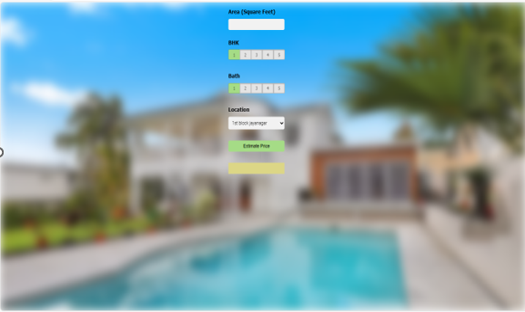

# 🏡 House Price Prediction System

This project is a **House Price Prediction** model built using **Machine Learning**. The goal is to assist home buyers, sellers, and real estate professionals in estimating fair property prices using data-driven techniques rather than relying solely on agents or subjective judgment.

## 📌 Table of Contents
- [Overview](#overview)
- [Tech Stack](#tech-stack)
- [Features](#features)
- [Dataset](#dataset)
- [Model Details](#model-details)
- [System Design](#system-design)
- [Limitations](#limitations)
- [Future Enhancements](#future-enhancements)
- [Screenshots](#screenshots)
- [System Architecture](#system-architecture)
- [How to Run](#how-to-run)
- [Author](#author)

---

## 📖 Overview

The real estate market can be confusing and inconsistent due to varying price quotes from agents. Our system solves this by predicting house prices using **Linear Regression** based on:
- Location
- Square footage
- Number of bedrooms (BHK)
- Number of bathrooms

## 🧠 Tech Stack

- Python
- Pandas, NumPy, Scikit-learn
- Flask (for UI integration)
- HTML/CSS (basic front-end)
- SQLite (or CSV for data)
- Visual diagrams via StarUML / Draw.io

## ✨ Features

- Automated price prediction using ML
- Easy-to-use interface for input
- Real-time estimation based on features
- Transparent and unbiased pricing

## 📊 Dataset

The dataset includes:
- Location data
- BHK (bedroom) count
- Total square footage
- Number of bathrooms
- Historical sale prices

Preprocessing includes:
- Null/missing value handling
- Outlier detection and removal
- Feature engineering for better predictions

## 📈 Model Details

- **Algorithm**: Linear Regression
- **Training Process**: Trained on historical data using train-test split and evaluated via RMSE & R² score.
- **Feature Scaling**: Applied where necessary to normalize the input data.

## 🛠️ System Design

The project includes:
- **ER Diagram**
- **Use Case & Class Diagrams**
- **Activity and Deployment Diagrams**
- **Testing Reports (Unit, Acceptance, Defect Logs)**

## ⚠️ Limitations

- Accuracy might drop if data is limited or outdated
- Doesn’t account for sudden market changes or neighborhood development

## 🚀 Future Enhancements

- Switch to more robust models like Random Forest or XGBoost
- Integration with real-time online listings (via APIs)
- Enhanced UI with dashboards (using Streamlit/React)
- Add property images and price estimate visualizations

## 🖼️ Screenshots

### 🔘 Input UI

### 📊 Predicted Price Output

### 🗺️ System Architecture

#### 1. Deployment Diagram
Shows how Flask backend, ML model, and UI are hosted and interact.

#### 2. Module Hierarchy
Illustrates how code files and components are structured in the project.

## ▶️ How to Run

1. Clone the repo
2. Install dependencies: `pip install -r requirements.txt`
3. Run the app: `python app.py`
4. Open browser at `http://localhost:5000`

## 👤 Author

- Udhav Rameshwar Kardile  
- – PG Diploma in Big Data Analytics, CDAC Mumbai
- - Masters of Computer Applications, Savitribai Phule Pune University

